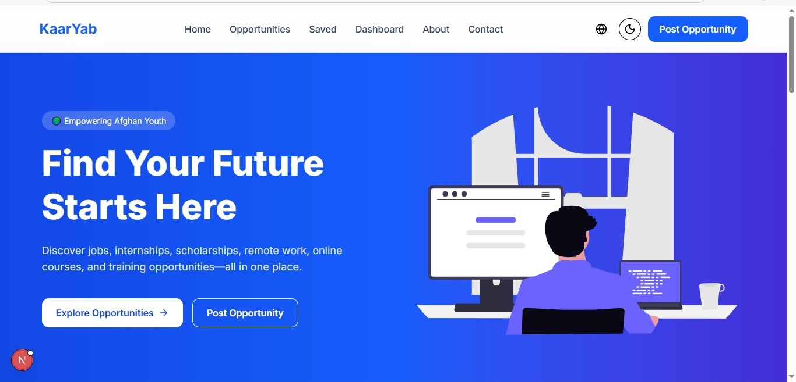
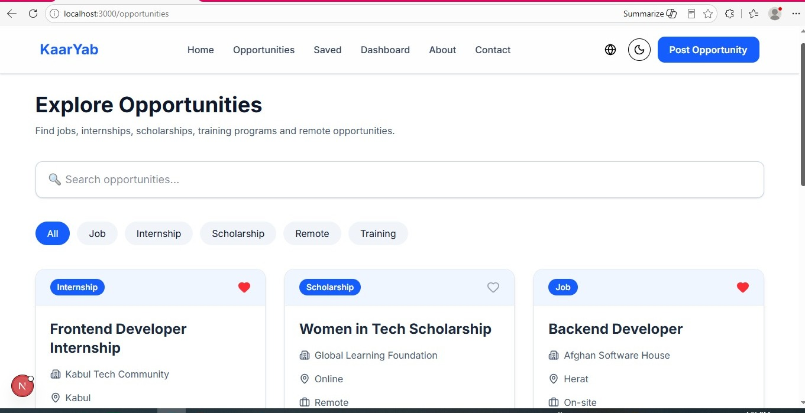
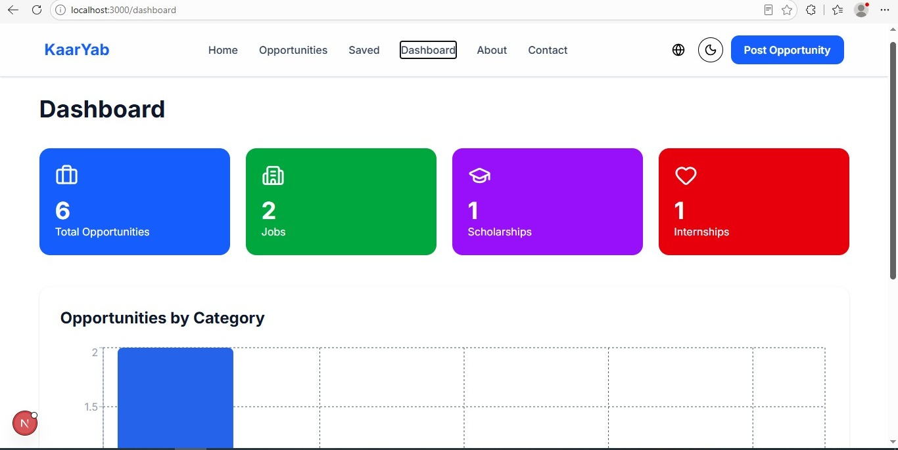
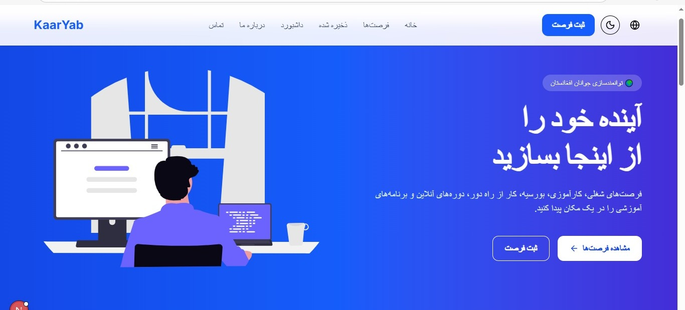

# KaarYab Afghanistan 🇦🇫

KaarYab Afghanistan is a web-based opportunity platform designed to help Afghan students and job seekers discover educational and professional opportunities in one place.

The platform brings together opportunities such as **jobs, internships, scholarships, online courses, training programs, volunteer opportunities, and remote work** through a modern, responsive, and accessible interface.

This project was developed as a **Final Capstone Project**, with a focus on practical functionality, responsive design, usability, and a clear user experience.

## 🌐 Live Demo

**[Visit KaarYab Afghanistan](https://kaaryab-afghanistan-ten.vercel.app/)**

## 🎯 Project Objective

Finding relevant opportunities can require searching across many different websites and platforms.

KaarYab aims to provide a centralized place where Afghan students and job seekers can discover and manage different types of opportunities through a simple and organized interface.

## ✨ Features

### 🔎 Opportunity Discovery

Users can:

- Browse available opportunities
- Search by title or organization
- Filter by category
- Filter by location
- Filter by opportunity type
- View detailed opportunity information

### 📝 Opportunity Management

Users can:

- Add new opportunities
- Edit existing opportunities
- Delete opportunities
- Save favorite opportunities

### 📂 Opportunity Categories

The platform supports:

- 💼 Jobs
- 🎓 Internships
- 🏆 Scholarships
- 🌍 Remote Work
- 📚 Training Programs
- 🤝 Volunteer Opportunities
- 💻 Online Courses

### 📊 Dashboard

The dashboard provides an overview of opportunity data, including:

- Total opportunities
- Jobs
- Internships
- Scholarships
- Category statistics
- Interactive data visualization

### 🌐 User Experience

- Responsive design for mobile, tablet, and desktop
- Dark mode
- English and Dari language support
- Right-to-left (RTL) support for Dari
- Form validation
- LocalStorage data persistence
- Reusable UI components
- Interactive user interface

## 🛠️ Tech Stack

### Frontend

- Next.js (App Router)
- React
- TypeScript
- Tailwind CSS

### Libraries & Tools

- React Hook Form
- Zod
- Recharts
- Lucide React
- next-themes
- Git & GitHub

## 📸 Screenshots

### Home Page



### Opportunities Page



### Opportunity Details


### Dashboard



### Add Opportunity


### Dark Mode


### Dari Language Support



## 📁 Project Structure

```text
kaaryab-afghanistan/
├── app/
│   ├── opportunities/
│   ├── dashboard/
│   ├── add-opportunity/
│   ├── edit/
│   └── layout.tsx
│
├── components/
│   ├── opportunity/
│   ├── dashboard/
│   ├── layout/
│   └── theme/
│
├── context/
│   ├── LanguageContext.tsx
│   └── SavedContext.tsx
│
├── data/
│   └── opportunities.ts
│
├── lib/
│   ├── storage.ts
│   └── validation.ts
│
├── types/
│   └── opportunity.ts
│
└── public/
    └── images/
